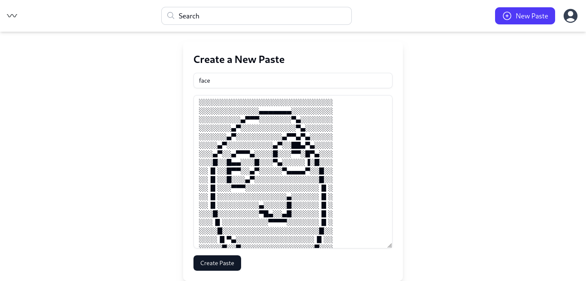
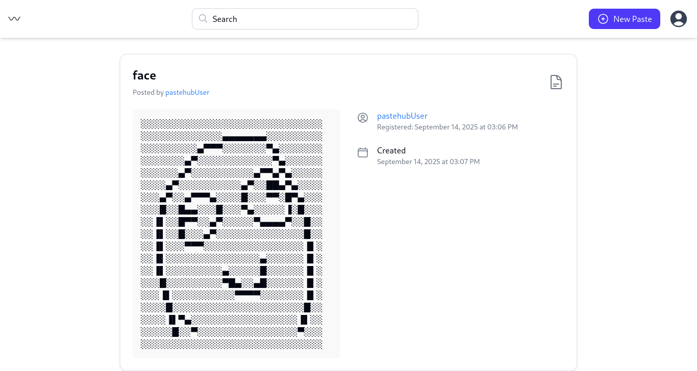
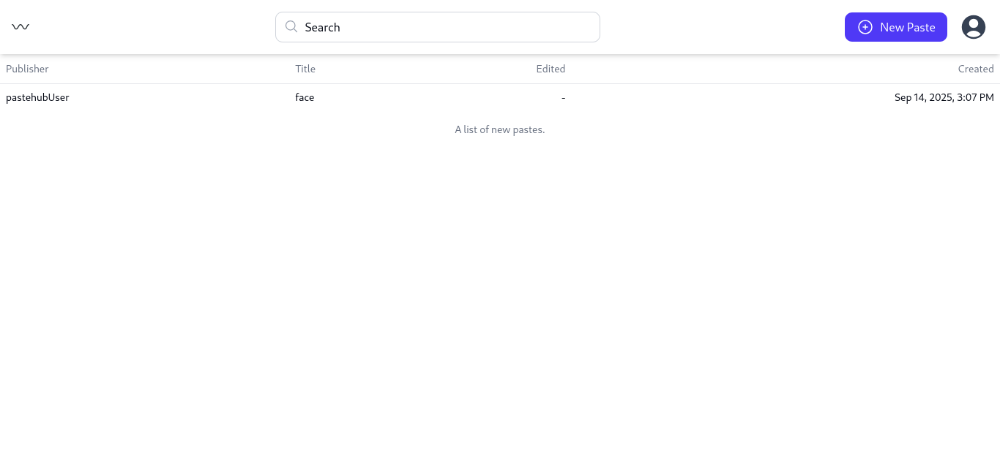
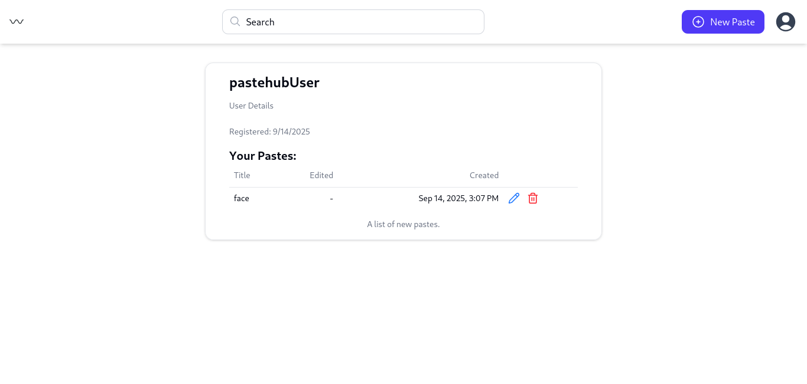
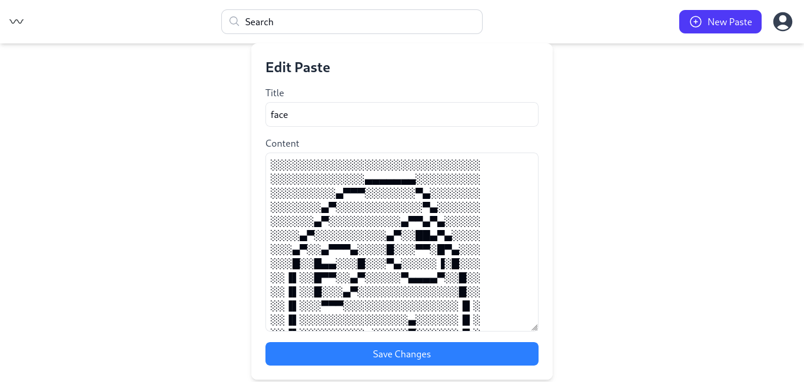

# PasteHub

[](https://golang.org/)
[](https://reactjs.org/)
[](https://www.typescriptlang.org/)
[](https://github.com/yourusername/pastehub)
[](https://github.com/yourusername/pastehub/actions)
[](https://github.com/yourusername/pastehub)
[](LICENSE)

PasteHub is a web application to create, share, and view text snippets (pastes) quickly. It features a Go-based backend API and a React + TypeScript frontend.

---

<!-- markdownlint-disable MD033 -->
<details>
<summary><strong>Features</strong></summary>

- Create and share pastes instantly  
- Optional expiration for pastes  
- Responsive and clean UI

</details>

<details>
<summary><strong>Project Structure</strong></summary>

```text
PasteHub/
├── pastehub-api/      # Backend API (Go)
├── pastehub-web/      # Frontend Web App (React + TS)
└── README.md
```

</details>

<details>
<summary><strong>Tech Stack</strong></summary>

- **Backend:** Go, Gin, GORM, MySQL  
- **Frontend:** React, TypeScript, TailwindCSS  

</details>

<details>
<summary><strong>Quick Start</strong></summary>

## Backend

```bash
cd pastehub-api
go mod tidy
# Set environment variables in .env
go run main.go
```

More [INFO](pastehub-api/README.md).

## Frontend

```bash
cd pastehub-web
npm install
# Set API URL in .env (e.g., VITE_API_URL=http://localhost:8080)
npm run dev
```

More [INFO](pastehub-web/README.md).
</details>

<details>
<summary><strong>Usage</strong></summary>

1. Open your browser at the frontend URL (default: `http://localhost:5173`)  
2. Create a new paste  
3. Share the generated link with anyone

</details>

<details>
<summary><strong>Demo / Screenshots</strong></summary>

### Create Paste



### View Paste



### View Paste List



### View Profile



### Edit Paste



</details>

<details>
<summary><strong>API Documentation (Mini)</strong></summary>

### Base URL

```text
http://localhost:8080/api
```

### Endpointsы

| Method | Endpoint          | Description           | Auth |
| ------ | ----------------- | --------------------- | ---- |
| POST   | /register         | Register a new user   | No   |
| POST   | /login            | Login & get JWT token | No   |
| GET    | /user             | Get current user info | Yes  |
| GET    | /user/\:id        | Get user by ID        | No   |
| GET    | /user/\:id/pastes | Get pastes by user    | No   |
| POST   | /paste      | Create a new paste          | Yes  |
| GET    | /paste/\:id | Get a paste by ID           | No   |
| PUT    | /paste/\:id | Update a paste              | Yes  |
| DELETE | /paste/\:id | Delete a paste              | Yes  |
| GET    | /pastes     | List all pastes (paginated) | No   |

### **Example: Create a Paste**

```bash
POST /paste
Content-Type: application/json
Authorization: Bearer YOUR_AUTH_KEY_HERE

{
  "title": "My Paste",
  "content": "Hello, world!"
}

```

More [INFO](pastehub-api/README.md).
</details>

<details>
<summary><strong>Future Features / Roadmap</strong></summary>

- User authentication & profiles  
- Private / password-protected pastes  
- Syntax highlighting for more languages  
- Paste search functionality  
- Dark mode for the frontend  
- Rate limiting and spam protection

</details>

<details>
<summary><strong>Contributing</strong></summary>

1. Fork the repo  
2. Create a new branch (`git checkout -b feature/YourFeature`)  
3. Commit your changes (`git commit -m 'Add feature'`)  
4. Push and open a Pull Request

</details>

<details>
<summary><strong>License</strong></summary>

MIT License. See [LICENSE](LICENSE).

</details>
